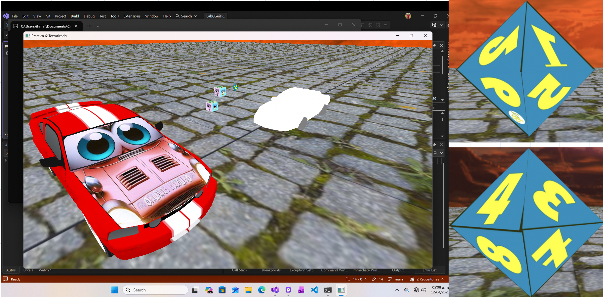

# Laboratorio de Computación Gráfica e Interacción Humano-Computadora 👾

## Práctica 6 : Texturizado

### 🎓 Datos del Alumno
* **Nombre:** Mejía Alba Israel Hipólito
* **No. Cuenta:** 315348079
* **Semestre:** 2026-2
* **Grupo de Laboratorio:** 03
* **Grupo de Teoría:** 06
* **Profesor:** Ing. José Roque Román Guadarrama

 

 ## 📝 Descripción del la Práctica

Este repositorio contiene el código fuente y los modelos 3D desarrollados para la Práctica 6, la cual se enfoca en la aplicación, mapeo y manipulación de texturas utilizando **OpenGL** (C++) y **Blender**. 

Dentro de la escena gráfica generada se integran los siguientes elementos:

* 🎲 **Dado de 6 caras (Emociones de *Intensa Mente*):** Texturizado de dos formas distintas para contrastar metodologías: procedimentalmente mediante código fuente (definiendo coordenadas UV/ST) y mediante un modelo importado texturizado en Blender.
* 💎 **Dado de 8 caras (Octaedro):** Texturizado estrictamente por código, calculando de manera manual y precisa las coordenadas espaciales y de textura para cada cara triangular.
* 🚗 **Modelo 3D Automotriz (Estilo *Cars*):** Integración de un modelo `.obj` (Mustang) modificado. Utilizando la herramienta *UV Editing* de Blender, se logró un texturizado híbrido que mezcla las texturas y materiales originales del vehículo con un diseño facial inspirado en la película de Pixar.
 

## 📸 Resultado Final

